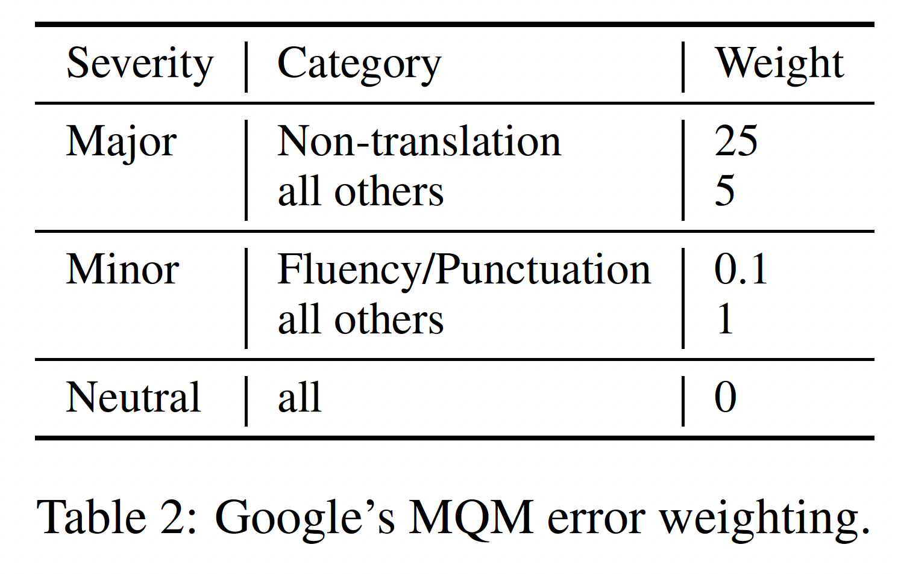
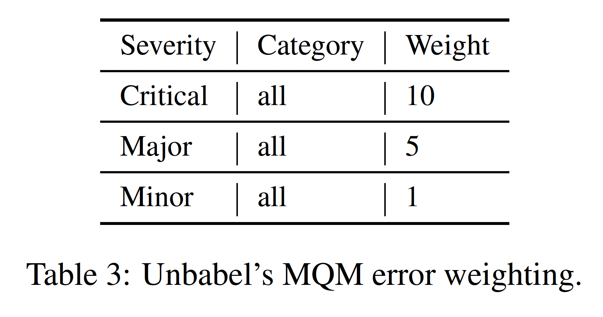

# Text Similarity - NLP Project ENSAE 2023

## Autors
Henri UPTON & Robin GUILLOT

## Overview

- [1. Introduction](#1-introduction)
- [2. Untrained Metrics](#2-untrained-metrics)
  - [2.1. Data & Installation](#21-data-and-installation)
  - [2.1. List of Metrics](#21-list-of-metrics)
  - [2.2. List of Criterions](#22-list-of-criterions)
- [3. Bonus : Trained Metrics](#4-trained-metrics)
- [5. Ressources](#5-ressources)
  - [5.1. Githubs](#5-githubs)
  - [5.2. Research Papers](#5-research-papers) 

## 1. Introduction

La tâche à l'étude est la traduction de texte par modèle NMT (Natural Text Translation). Nous disposons de divers langages dits *source* ($sl$ pour "source langage") et langages dits *cibles* ($tl$ pour "target langage"). L'objectif du modèle de NMT est de traduire un ensemble de phrases du langage source en langage cible le plus qualitativement possible.

Ce dernier aspect de qualité de traduction est le point central de notre étude. En effet la tâche principale de nos analyses est de constituer un ensemble de métriques permettant d'évaluer la qualité d'une traduction unique. Le critère le plus important lors de l'évaluation de la qualité de telles métriques est leur corrélation avec le jugement humain. Conceptuellement, pour chaque couple (*sl*,*tl*), nous disposons d'un dataset $D = {R_{i}, {C_{i}, h(C_{i})}}_{i = 1}^{N}$ où pour une observation $i$, $R_{i}$ correspond à la séquence source à traduire, $C_{i}$ la traduction candidate par le modèle de NMT à l'étude, et $h(C_i)$ correspond à l'évaluation de la traduction $C_i$ par un humain. 

## 2. Untrained Metrics 

L'idée principale du projet est d'évaluer des métriques qui mesurent la performance de systèmes de traduction. Un des premiers critères à considérer est leur corrélation avec le jugement humain. Les données du WMT22 nous permettent d'affecter un score humain à chaque traduction candidate des systèmes considérés via le calcul des scores **MQM** (Multidimensional Quality Metrics). Le **MQM** est un type de **Golden Score** car il correspond à un score basé sur les erreurs identifiées par les experts humains.

### 2.1. Data & Installation

Nous disposons de trois paires de langages source (**sl** pour "source langage") et langages cibles (**tl** pour "target langage") :

- *English-German* : **ende**
- *Chinese-English* : **zhen**
- *English-Russian* : **enru**

Pour chacune de ces trois paires, nous disposons de deux bases de données issues du GitHub Google MQM Human Evaluation (https://github.com/google/wmt-mqm-human-evaluation) :

1 - **Base de données "Liste Candidats"** : répertorie les traductions de différents modèles de langage (**hyp** pour hypothèse), les phrases source (**source**), les traductions de référence établies par des experts (**ref** pour référence). 

2 - **Base de données "Correction des Candidats"** : répertorie l'ensemble des erreurs faites par les modèles de traduction. Un expert humain a annoté pour chaque traduction candidate de chaque système les erreurs de traduction, en indiquant pour chaque erreur son type et sa sévérité, c'est à dire s'il s'agit d'une faute importante ou non. 

Ici, le MQM pour chaque traduction candidate se calcule comme la somme sur toutes les erreurs identifiées des poids associés à leur sévérité. Les poids sont donc à percevoir comme des pénalités, où le score de la traduction se voit décrémenté d'une certaine valeur pour chaque erreur commise. Formellement, on peut écrire : 

\begin{equation}
MQM_{hyp} = - \sum_{error \in Errors} w_{error} 
\end{equation}

Le barème des poids par type d'erreur provient du concours WMT 2021, et deux tableaux récapitulatifs provenant de l'article *"Results of the WMT21 Metrics Shared Task: Evaluating Metrics with Expert-based Human Evaluations on TED and News Domain"* (https://aclanthology.org/2021.wmt-1.73/) dresse une liste exhaustive de ceux ci. La table 2 (Google MQM) est utilisée pour les paires *English-German* : **ende** et *Chinese-English* : **zhen**. La table 3 (Unlabel MQM) est utilisée pour la paire *English-Russian* : **enru**.

### I.1 - *English-German* (**ende**) et *Chinese-English* (**zhen**) : **Google's MQM error**

### I.2 - *English-Russian* (**enru**) : **Unlabel's MQM error**

### 2.2. List of Metrics

ajouter list metrics

### 2.3. List of Criterions

ajouter list criterions

## 3. Bonus : Trained Metrics

 Les phrases d'entrée sont issues de diverses pages Wikipedia. Voici la liste des couples (sl, tl) accompagnés de leur diminutif (sl-tl) :

- English-German (en-de)
- English-Chinese (en-zh)
- Romanian-English (ro-en)
- Estonian-English (et-en)
- Nepalese-English (ne-en)
- Sinhala-English (si-en)

La base de données MLQE (MultiLingual Quality Estimation) provient du GitHub *facebookresearch* suivant : https://github.com/facebookresearch/mlqe

Elle a fait l'objet de recherches dans le cadre du concours "2020 Quality Estimation Shared Task" : http://www.statmt.org/wmt20/quality-estimation-task.html

Pour ce faire, chaque traduction unique est accompagnée d'un groupe de scores qui représente des évaluations humaines de la qualité d'une traduction par des experts en traduction. Les scores sont nommés DA Scores (Direct Assessment Score) et représentent un jugement sur une échelle de 0 à 100, 100 étant la note maximale. 

Les données sont organisées de la façon suivante : chaque élément concernant un couple ($sl-$tl) est regroupé dans un dossier compressé au format **.tar.gz**. 
- sl-tl_test.tar.gz : contient les données de dev et de train
- sl-tl.tar.gz : contient les données de test

Pour un dataset de données on dispose des variables suivantes :

1) index: l'identifiant unique de l'observation
2) original: phrase source (dans le langage source $sl$)
3) translation: phrase candidate (dans le langage target $tl$)
4) scores: liste des DA scores de plusieurs experts pour le couple (original, translation) associé
5) mean: moyenne des DA scores associés
6) z_scores: liste des z-standardizé DA scores
7) z_mean: moyenne des z-standardizé DA scores
8) model_scores: NMT model score for sentence (à omettre)

D'autres informations annexes sont disponibles :

`doc_ids` : fichier listant la provenance de chaque phrase source (la page Wikipedia dans laquelle elle provient)

`word-probas` : repertoire contenant :
 
* `word_probas.*.$sl$tl`: log-probabilities from the NMT model for each decoded token including the <eos> token
* `mt.*.$sl$tl`: the actual output of the NMT model before any post-processing, corresponding to the log-probas
 above (the <eos> token is not printed, so the number of log-probabilities equals the number of tokens plus 1)

## 5. Ressources

### 5.1. GitHubs

Google WMT MQM Human Evaluation : https://github.com/google/wmt-mqm-human-evaluation

Facebook Research - MLQE Dataset : https://github.com/facebookresearch/mlqe

Benchmark correlation of existing metrics with human scores :(https://github.com/PierreColombo/nlg_eval_via_simi_measures). Different possible generation tasks top work on : translation , data2text generation , story generation.

### 5.2. Research Papers
[0] A Pseudo-Metric between Probability Distributions based on Depth-Trimmed Regions G Staerman, P Mozharovskyi, P
Colombo, S Clémençon, F d'Alché-Buc

[1] Pierre Colombo, Nathan Noiry, Ekhine Irurozki, Stephan Clemencon What are the best systems? New perspectives on NLP
Benchmarking NeurIPS 2022

[2] Cyril Chhun, Pierre Colombo, Fabian Suchanek, Chloe Clavel Of Human Criteria and Automatic Metrics: A Benchmark of
the Evaluation of Story Generation (oral) COLING 2022

[3] Pierre Colombo, Chloé Clavel and Pablo Piantanida. InfoLM: A New Metric to Evaluate Summarization & Data2Text
Generation. Student Outstanding Paper Award (oral) AAAI 2022

[4] Pierre Colombo, Guillaume Staerman, Chloé Clavel, Pablo Piantanida. Automatic Text Evaluation through the Lens of
Wasserstein Barycenters. (oral) EMNLP 2021

[5] Pierre Colombo, Maxime Peyrard, Nathan Noiry, Robert West, Pablo Piantanida. The Glass Ceiling of Automatic
Evaluation in Natural Language Generation

[6] Hamid Jalalzai, Pierre Colombo , Chloe Clavel, Eric Gaussier, Giovanna Varni, Emmanuel Vignon, and Anne Sabourin.
Heavy-tailed representations, text polarity classification & data augmentation. NeurIPS 2020

[7] Alexandre Garcia,Pierre Colombo, Slim Essid, Florence d’Alché-Buc, and Chloé Clavel. From the token to the review: A
hierarchical multimodal approach to opinion mining. EMNLP 2020

