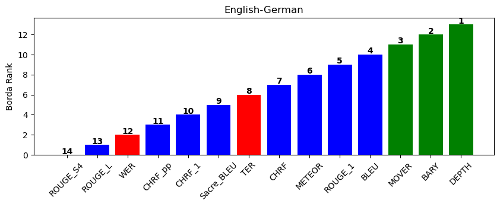
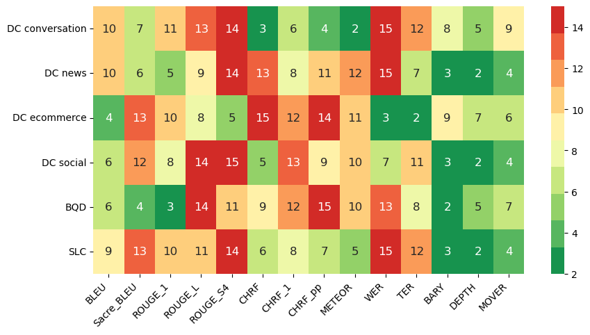

# *The Metrics Maze* : Navigating the Landscape of Evaluation Techniques for MT Systems

[](https://github.com/psf/black)

[](https://my-project.com)


## Autors
Henri UPTON & Robin GUILLOT

# Overview

- [1. Introduction](#1-introduction)
- [2. Untrained Metrics](#2-untrained-metrics)
  - [2.1. Data & Installation](#21-data-and-installation)
  - [2.1. List of Metrics](#21-list-of-metrics)
  - [2.2. List of Criterions](#22-list-of-criterions)
- [4. Ressources](#5-ressources)
  - [4.1. Githubs](#5-githubs)
  - [4.2. Research Papers](#5-research-papers) 


# 1. Usage

## 1.1. Installation

Frist, clone the repository :
```python
git clone -r requirements.txt
```

Then, create a virtual enviroment dedicated to this repository :
```python
conda create -n project_nlp
conda activate project_nlp
```

Then, install the requirements : 

```python
pip install -r requirements.txt
```

## 1.2. Notebooks / Functions

The notebook [data_exploration.ipynb](data_exploration.ipynb) is about data loading and vizualisations. All functions used there come from [data_processing.py](./code/data_processing.py) :
```python
from data_processing import WMT22, dataset
from WMT22 import data_gold_scores, read_data
```

The notebook [test_metrics.ipynb](test_metrics.ipynb) test all the candidate metrics and runs the metrics computation process. All functions used there come from [metrics.py](./code/metrics.py) :
```python
# n-gram based metrics :
from metrics import BLEU, Sacre_BLEU, ROUGE_1, ROUGE_L, ROUGE_S4, CHRF, CHRF_1, CHRF_pp, METEOR
# edit based metrics :
from metrics import TER, WER
# embedding based metrics :
from metrics import BARY, DEPTH, MOVER
# compute and test metrics:
from metrics import compute_metrics, test_metrics
```
The notebook [test_criterions.ipynb](test_criterions.ipynb) use all metrics results to proceed a benchmark w.r.t criterions (see 3. List of Criterions). All functions used there come from [criterions.py](./code/criterions.py) :
```python
from criterions import Borda_count, plot_rank_per_citerion, plot_borda_ranks
```

# 1. Problem Framing

Over the years, more and more untrained text similarity metrics have emerged in a context where tasks are becoming increasingly numerous, such as text summarization, story writing, or translation. Compared to trained metrics, they are independent of a training set and must perform well in any context. Therefore, it becomes increasingly important to compare these metrics in order to clearly identify which ones perform the best.

All untrained metrics can be divided into three categories: n-gram based, edit-based, and embedding-based. The objective of this paper is to compare all these types of metrics and to build a benchmark protocol to rank the performance of these metrics based on a list of criteria. Methods such as Borda count are used to aggregate the ranks obtained for each criterion. The focus is on the task of translation.

# 2. WMT22 Dataset

Automatic evaluation for Machine Translation (MT) has become a challenging issue for the last decade. Since 2006, a huge Conference on MT research, WMT, is held annually since 2006, with competitions on different aspects of MT including the submission of automatic metrics producing scores for translations that have to be the best correlated with those produced by human judgments. 

## 2.1. Candidates, References
We focus our study on the WMT22 database, which provides sets of translations performed by NLG systems, from a source language (sl) to a target language (tl). We dispose of three pairs of source and target languages:

- *English-German* : **ende**
- *Chinese-English* : **zhen**
- *English-Russian* : **enru**

For each of these three pairs, we have access to two databases thanks to the [Google MQM Human Evaluation GitHub](https://github.com/google/wmt-mqm-human-evaluation), which proposes all our variables of interest:

  1- **"Candidate List"** database: translations candidates from different NLG systems (**hyp** for hypothesis), source sentences (**source**), and reference translations established by experts (**ref** for reference). Note that each candidate translation, there is **only one reference translation**. We also have access to the domain, the id of the segment 

  2- **"Candidate Correction"** database: lists all errors made by NLG systems: several human experts has annotated for each candidate translation the translation errors, indicating for each error its type and severity, i.e., whether it is a significant error or not.


## 2.2. Gold Scores

One of the first criteria to consider when evaluating untrained metrics is their correlation with human judgment. The WMT22 data allows us to assign a human score to each candidate translation of the considered systems by calculating the MQM (Multidimensional Quality Metrics) scores. MQM is a type of reference because it aggregates all errors identified by human experts.


$MQM_{hyp} = - \sum_{error \in Errors} w_{error}
$

The scale of weights per type of error comes from the WMT21 contest and two summary tables from [here](https://aclanthology.org/2021.wmt-1.73.pdf) list them exhaustively

# 3. List of Metrics

| N-Gram Based | Edit Based | Embedding Based |
|--------------|------------|----------------|
| <span style="color: blue;">*BLEU*, *Sacre_BLEU*, *ROUGE_1*, *ROUGE_L*, *ROUGE_S4*, *METEOR*, *CHRF*, *CHRF_1*, *CHRF_++*</span> | <span style="color: green;">*TER*, *WER*</span> | <span style="color: red;">*DepthScore*, *MoverScore*, *BaryScore*</span> |

# 3. List of Criterions

| Name (Abbreviation) | Intuition |
|-----------|-----------|
| *Domain Coverage* **(DC)** | Does the metric perform well for translating sentences from various domains (social, e-commerce, conversation, news)?  |
| *Bad Quality Detection* **(BQD)** | Does the metric effectively detect poor-quality samples (i.e., those with the lowest gold scores)?  |
| *Segment Level Correlation* **(SLC)** | Does the metric accurately identify the overall quality of a segment (i.e., is its average score per segment well correlated with the gold average score per segment)?  |


# 4. Technical Results

Here is some results obtained for the translation pair *English-German* (**ende**) :

- *Aggregated Ranks of each metric  obtained by Borda's Count procedure*



- *Ranks of each metric along the different criteria* :



All of our research can be found in our report : (TBU)

# 5. Ressources

## 5.1. GitHubs

[Google WMT MQM Human Evaluation](https://github.com/google/wmt-mqm-human-evaluation)

[NLG Evaluation via Similarity Measures](https://github.com/PierreColombo/nlg_eval_via_simi_measures)


## 5.2. Research Papers
- [@sacrebleu] Matt Post. (2018). A Call for Clarity in Reporting BLEU Scores. arXiv preprint arXiv:1804.08771. https://arxiv.org/abs/1804.08771

- [@bleu] Kishore Papineni, Salim Roukos, Todd Ward, & Wei-Jing Zhu. (2002). Bleu: A Method for Automatic Evaluation of Machine Translation. In Proceedings of the 40th annual meeting of the Association for Computational Linguistics (pp. 311–318). https://aclanthology.org/P02-1040.pdf

- [@rouge] Chin-Yew Lin. (2004). Rouge: A Package for Automatic Evaluation of summaries. In Text summarization branches out (pp. 74–81). https://aclanthology.org/W04-1013.pdf

- [@rouge_var] Chin-Yew Lin & Franz Josef Och. (2004). Automatic Evaluation of Machine Translation Quality Using Longest Common Subsequence and Skip-Bigram Statistics. In Proceedings of the 42nd Annual Meeting of the Association for Computational Linguistics (pp. 605–612). https://aclanthology.org/P04-1077.pdf

- [@meteor] Alon Lavie & Abhaya Agarwal. (2007). Meteor: An Automatic Metric for MT Evaluation with High Levels of Correlation with Human Judgments. In Proceedings of the Second Workshop on Statistical Machine Translation (pp. 228–231). https://aclanthology.org/W07-0734.pdf

- [@chrf] Maja Popović. (2015). chrF: character n-gram F-score for Automatic MT Evaluation. In Proceedings of the Tenth Workshop on Statistical Machine Translation (pp. 392–395). https://aclanthology.org/W15-3049.pdf

- [@chrfp] Maja Popović. (2017). chrF++: words helping character n-grams. In Proceedings of the Second Conference on Machine Translation (pp. 612–618). https://www.statmt.org/wmt17/pdf/WMT70.pdf

- [@wer] Sonja Nießen, Franz Josef Och, Gregor Leusch, & Hermann Ney. (2000). An Evaluation Tool for Machine Translation: Fast Evaluation for MT Research. In Proceedings of the 2nd International Conference on Language Resources and Evaluation. https://aclanthology.org/www.mt-archive.info/LREC-2000-Niessen.pdf

- [@ter] Matthew Snover, Bonnie Dorr, Richard Schwartz, Linnea Micciulla, & John Makhoul. (2006). A Study of Translation Edit Rate with Targeted Human Annotation. In Proceedings of the 7th Conference of the Association for Machine Translation in the Americas: Technical Papers (pp. 223–231). https://aclanthology.org/2006.amta-papers.25.pdf

- [@bert] Tianyi Zhang, Varsha Kishore, Felix Wu, Kilian Q. Weinberger, & Yoav Artzi. (2019). Bertscore: Evaluating text generation with BERT. arXiv preprint arXiv:1904.09675. https://arxiv.org/pdf/1904.09675.pdf

- [@mover] Wei Zhao, Maxime Peyrard, Fei Liu, Yang Gao, Christian M. Meyer, & Steffen Eger. (2019). MoverScore: Text Generation Evaluating with Contextualized Embeddings and Earth Mover Distance. URL : https://arxiv.org/abs/1909.02622

- [@depth]: Guillaume Staerman, Pavlo Mozharovskyi, Pierre Colombo, Stéphan Clémençon, and Florence d'Alché-Buc. 2021. A Pseudo-Metric between Probability Distributions based on Depth-Trimmed Regions. *arXiv preprint arXiv:2103.12711*. URL: https://arxiv.org/pdf/2103.12711.pdf.

- [@bary]: Pierre Colombo, Guillaume Staerman, Chloé Clavel, and Pablo Piantanida. 2021. Automatic Text Evaluation through the Lens of Wasserstein Barycenters. *arXiv preprint arXiv:2108.12463*. URL: https://aclanthology.org/2021.emnlp-main.817.pdf.

- [@glass]: Pierre Colombo, Maxime Peyrard, Nathan Noiry, Robert West, and Pablo Piantanida. 2022. The Glass Ceiling of Automatic Evaluation in Natural Language Generation. URL: https://deepai.org/publication/the-glass-ceiling-of-automatic-evaluation-in-natural-language-generation

- [@wmtresults]: Markus Freitag, Ricardo Rei, Nitika Mathur, Chi-kiu Lo, Craig Stewart, George Foster, Alon Lavie, and Ondřej Bojar. 2021. Results of the WMT21 Metrics Shared Task: Evaluating Metrics with Expert-based Human Evaluations on TED and News Domain. In *Proceedings of the Sixth Conference on Machine Translation*, pages 733--774. URL: https://aclanthology.org/2021.wmt-1.73.pdf.

- [@dataWMT]: Markus Freitag, George Foster, David Grangier, Viresh Ratnakar, Qijun Tan, and Wolfgang Macherey. 2021. Experts, Errors, and Context: A Large-Scale Study of Human Evaluation for Machine Translation. *arXiv preprint arXiv:2104.14478*. URL: https://arxiv.org/pdf/2104.14478.pdf.


